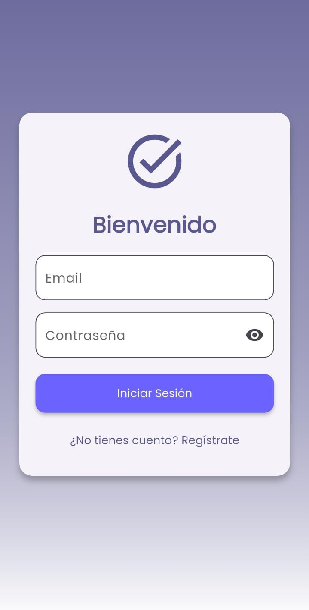
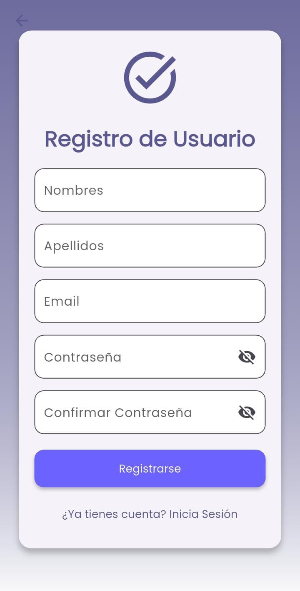
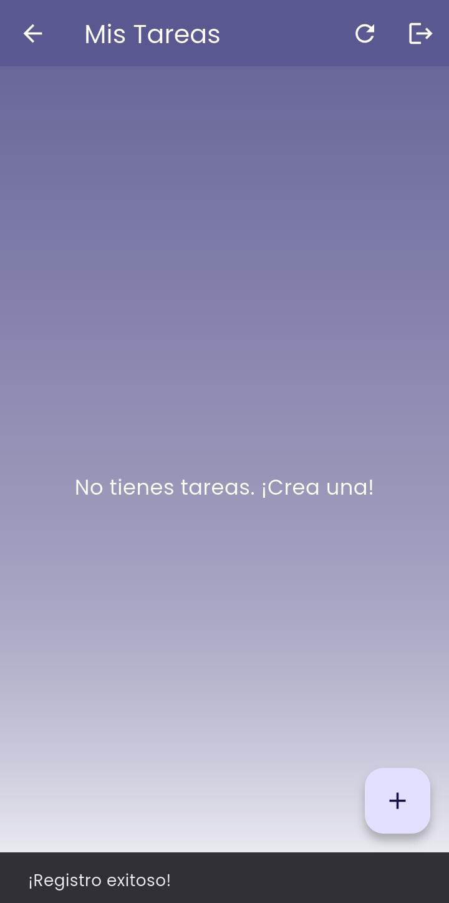
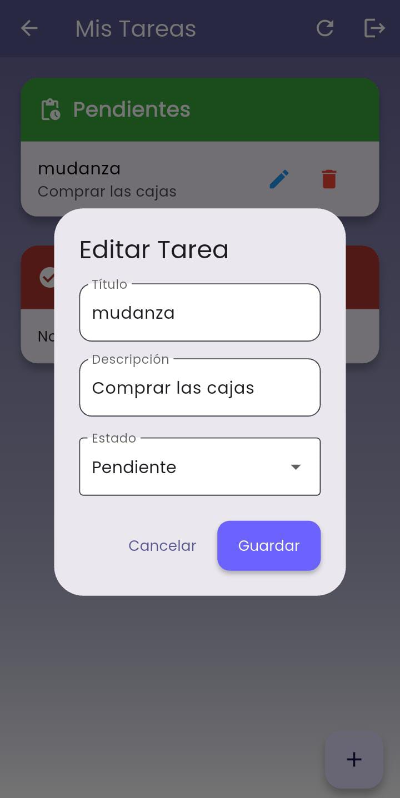
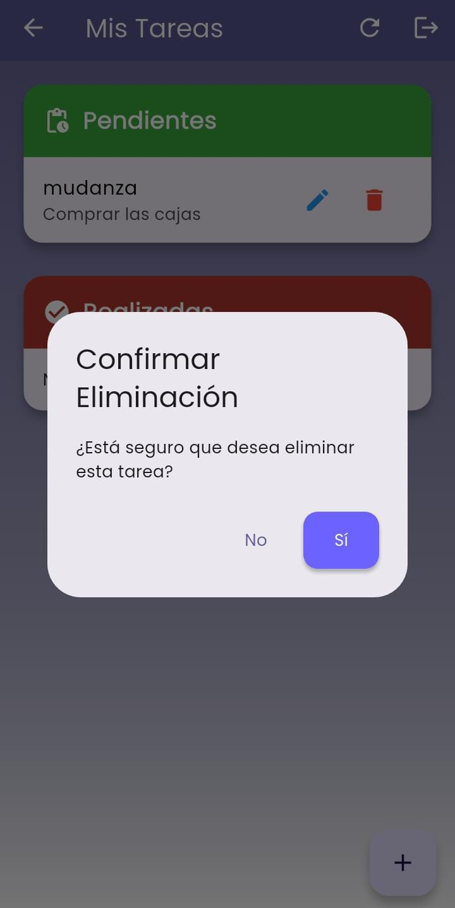
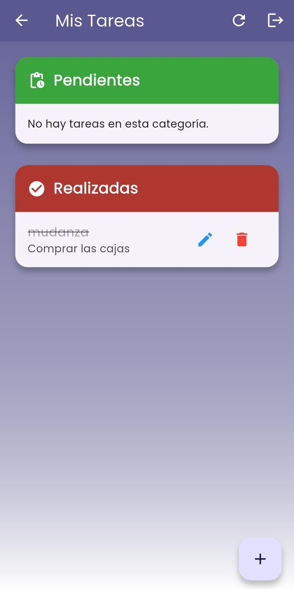

# 📋 Gestor de Tareas Personal

Este es un proyecto de aplicación móvil monolítica desarrollado con Flutter para la gestión de tareas (CRUD). El frontend (la aplicación móvil) y el backend (la API) se encuentran en el mismo repositorio de GitHub. El objetivo principal es proporcionar una interfaz de usuario simple e intuitiva para que los usuarios puedan crear, leer, actualizar y eliminar sus tareas. La aplicación se conecta a una API de backend para persistir los datos de las tareas y manejar la autenticación de usuarios.

---

## 🚀 Descripción del proyecto

La aplicación permite:
- Ver todas las tareas (pendientes y completadas) de un vistazo.
- Agregar nuevas tareas con un flujo rápido y sencillo.
- Editar tareas existentes para corregir o actualizar información.
- Marcar tareas como completadas o volver a ponerlas como pendientes.
- Eliminar tareas que ya no son necesarias.
- Manejo claro de errores y estados de carga.

---

## 🛠️ Stack Tecnológico

### **Frontend (mobile)**
- [Flutter](https://flutter.dev/) (Dart)
- Manejo de estado con `setState` 
- HTTP con `http` package para comunicación con el backend.

### **Backend**
- [NestJS](https://nestjs.com/) (Node.js + TypeScript)
- [TypeORM](https://typeorm.io/) + [PostgreSQL](https://www.postgresql.org/)
- Validaciones con `class-validator` y `class-transformer`
- Estructura modular siguiendo principios RESTful
- Seguridad: JWT + bcrypt para autenticación y autorización
- CORS configurado para permitir conexión con la app móvil en producción.

---

## 🌐 URLs de Producción

- **Backend (Render)**: [https://tu-backend.onrender.com](https://tu-backend.onrender.com)
- **APK (Google Drive)**: [Descargar APK aquí](https://drive.google.com/file/d/18PlPcv3HQEHkFUJ5tT5ETeqYJipaMmnw/view?usp=drive_link)
- **Demo en navegador (Appetize.io)**: [Probar aquí](https://appetize.io/embed/b_pqdpuuitpfecvkplmdubnzpqf4)

---
🛠️ Endpoints de la API
La aplicación se comunica con un backend a través de los siguientes endpoints para gestionar las tareas.

- Endpoint	Método	Descripción
- /auth/register	POST	Registra un nuevo usuario.
- /auth/login	POST	Autentica a un usuario y devuelve un token JWT.
- /tasks	GET	Obtiene todas las tareas del usuario autenticado.
- /tasks	POST	Crea una nueva tarea.
- /tasks/:id	PUT	Actualiza una tarea existente por su ID.
- /tasks/:id	DELETE	Elimina una tarea por su ID.

---
## 📱 Capturas de pantalla

| Login | Register | Dashboard | Add Task | Edit Task | Delete Task | Main Dashboard |
|-----------------|---------------|--------------|--------------|--------------|--------------|--------------|
|  |  |  |  |  |  |  |

---

## ⚙️ Instalación y ejecución local

### 1. Clonar el repositorio

- git clone https://github.com/usuario/proyecto-tareas.git

### 2. Ejecución del Backend
Ve al directorio raíz del proyecto y ejecuta el siguiente comando para instalar las dependencias del backend:

- Bash
- cd server
- npm install

### 3. Configura las variables de entorno
Crea un archivo llamado .env en la raíz del proyecto. Este archivo debe contener las variables de configuración para la base de datos y el JWT. Aquí tienes un ejemplo de cómo debe lucir:

- DB_HOST=your DB_HOST
- DB_PORT=your DB_PORT
- DB_USERNAME=your DB_USERNAME
- DB_PASSWORD=your DB_PASSWORD
- DB_NAME=your DB_NAME
- JWT_SECRET=your JWT_SECRET

### 4. Inicia el servidor de desarrollo
Ejecuta el siguiente comando para correr el backend en modo de desarrollo:

Bash
- npm run start:dev
- El servidor se iniciará en http://localhost:3000 (o el puerto que hayas configurado).

## Ejecución del Frontend (Aplicación Flutter)
Asegúrate de que la API esté corriendo.

## 1. Prerrequisitos
Asegúrate de tener instalado lo siguiente:

- Flutter SDK: Instalación de Flutter
- Git: Descargar Git
- Visual Studio Code u otro IDE con soporte para Flutter/Dart.

## 2. Instala las dependencias
- Bash
- flutter pub get

## 3. Configura las variables de entorno
Asegúrate de que la URL de tu API de backend esté configurada correctamente en lib/utils/constants.dart.

## 4. Ejecuta la aplicación
Con un emulador o un dispositivo físico conectado, ejecuta el siguiente comando:

- Bash
- flutter run

